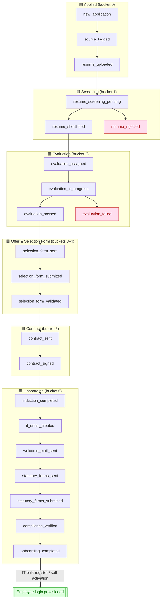
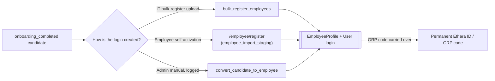

# Candidate → Employee Application Flow

_The complete journey of a person through the Ethara HRMS, from first application to a
provisioned employee with their own login._

This document is generated from the live code, not a whiteboard. The source of truth is:

| Concern | Where it lives |
| --- | --- |
| The 22 canonical stages | `CandidateStage` enum — `ethara-hrms-api/app/db/models.py:94` |
| Backend gating (7 ordered buckets) | `STAGE_BUCKETS` — `ethara-hrms-api/app/services/workflows.py:802` |
| Dashboard display buckets (8) | `PIPELINE_BUCKETS` — `ethara-hrms/src/app/dashboard/module-overview/module-dashboard-client.tsx:277` |
| Stage-advancing staff actions | `ethara-hrms-api/app/api/routes/workflows.py` |
| Candidate → Employee conversion | `convert_candidate_to_employee()` — `ethara-hrms-api/app/services/employees.py:3449` |
| Auto-provisioning kill-switch | `auto_employee_provisioning` (default `False`) — `ethara-hrms-api/app/core/config.py:194` |

---

## 1. Actors

| Actor | Role in the journey |
| --- | --- |
| **Applicant / Candidate** | Applies, uploads resume, submits the Selection Form, signs the contract, submits statutory forms, later self-activates the employee login. |
| **RS (Recruitment & Selection) staff** | Sources/tags candidates, screens resumes, shortlists, assigns evaluations, sends the Selection Form, validates it, sends the contract. |
| **Evaluator / Panel** | Runs the evaluation / PI (personal interview) rounds and records pass/fail. |
| **HR** | Owns onboarding: induction, welcome, statutory forms, compliance verification, penny-drop bank check. |
| **IT** | Creates the corporate email and (post-onboarding) bulk-registers the employee account. |
| **Admin** | Override authority — can force stage transitions and manual onboarding (all logged). |
| **System (automation)** | Vertex AI OCR, Gemini/Vertex resume screening, Documenso e-sign, SES email, greytHR leave sync, Celery jobs. |

---

## 2. The journey at a glance

> **Gating rule:** the pipeline is enforced **bucket by bucket**, not stage by stage
> (`STAGE_BUCKETS`, `workflows.py:802`). Within a bucket, automated steps routinely skip
> sub-stages. You cannot jump a candidate ahead past an unreached bucket — except by an
> **admin override**, which is logged.

---

## 3. Stage-by-stage detail

Legend — **Who** triggers it · **What** the system does · **Gate/branch**.

### Bucket 0 — Applied
| Stage | Who | System action | Gate / branch |
| --- | --- | --- | --- |
| `new_application` | Applicant (public portal) or RS | Candidate record created. | Entry point — see §5. |
| `source_tagged` | RS | Source/channel tagged (referral, campus, job board…). | — |
| `resume_uploaded` | Applicant / RS | Resume stored; text extracted (`_extract_resume_text`, `candidates.py:514`). Aadhaar/doc OCR at registration via **Vertex AI** (primary) with local RapidOCR fallback. | — |

### Bucket 1 — Screening
| Stage | Who | System action | Gate / branch |
| --- | --- | --- | --- |
| `resume_screening_pending` | RS / automated | Resume screened by **Gemini / Vertex AI**; a `ScreeningRecord` is produced (`POST /candidates/{id}/screen`; override `POST /workflows/screening/{id}/override`). | — |
| `resume_shortlisted` | RS (or auto-pass) | Candidate advances to Evaluation. | ✅ pass path |
| `resume_rejected` | RS / auto-fail | **Exit branch** — candidate leaves the funnel here. | ❌ reject |

### Bucket 2 — Evaluation
| Stage | Who | System action | Gate / branch |
| --- | --- | --- | --- |
| `evaluation_assigned` | RS | `Evaluation` created and assigned (`POST /workflows/evaluations`). | — |
| `evaluation_in_progress` | Evaluator | PI rounds scheduled/conducted — up to **5 PI rounds** supported (`schedule`, `pi-bypass` endpoints). | — |
| `evaluation_passed` | Evaluator | Recorded pass; PMS score may be captured (`pms-score`). | ✅ pass path |
| `evaluation_failed` | Evaluator | **Exit branch** — candidate leaves the funnel here. | ❌ reject |

### Buckets 3–4 — Offer & Selection Form
| Stage | Who | System action | Gate / branch |
| --- | --- | --- | --- |
| `selection_form_sent` | RS | Selection Form link emailed to candidate (`FRONTEND_URL` must be live). | — |
| `selection_form_submitted` | **Candidate** | Candidate fills personal/bank/document details; uploads docs (Aadhaar, PAN, passport photo, cancelled cheque, etc.). Docs OCR-verified via Vertex (`process_selection_form_document_verification`, `workflows.py:505`); mismatches flagged `needs_review`. | Passport photo collected here. |
| `selection_form_validated` | RS | Staff validates submission (`PATCH /workflows/selection-forms/{id}/validate`). Auto-validation runs when all required docs pass. | **Own bucket 4** — a hard gate before Contract. |

### Bucket 5 — Contract
| Stage | Who | System action | Gate / branch |
| --- | --- | --- | --- |
| `contract_sent` | RS | **Documenso** e-sign envelope sent: Offer Letter + NDA + Employment Agreement (3 items). GRP employee code is allocated at this point. | — |
| `contract_signed` | **Candidate** | Candidate e-signs; each of the 3 envelope items captured as a signed document. | ✅ — but **no login is minted here** (auto-provisioning off). |

### Bucket 6 — Onboarding
| Stage | Who | System action | Gate / branch |
| --- | --- | --- | --- |
| `induction_completed` | HR | Induction marked done. | — |
| `it_email_created` | IT | Corporate `@ethara.ai` email provisioned (IT request queue). | — |
| `welcome_mail_sent` | HR / system | Welcome email sent (SES, ap-south-1). | — |
| `statutory_forms_sent` | HR | Statutory/compliance forms sent for e-sign via Documenso (`POST /workflows/compliance/send-esign/{id}`). | — |
| `statutory_forms_submitted` | **Candidate** | Candidate signs statutory forms; synced back (`compliance/sync`). | — |
| `compliance_verified` | HR | Forms verified; **penny-drop bank verification** (office_admin + HR) confirms bank details from the Selection Form. | — |
| `onboarding_completed` | HR / system | Journey as a *candidate* is complete. | ➡️ hand-off to Employee (§4). |

---

## 4. The Candidate → Employee boundary ⭐

This is the most important transition and the one most often misunderstood.

**Reaching `onboarding_completed` does NOT automatically create an employee login.**

- `auto_employee_provisioning` defaults to **`False`** (`config.py:194`). The old
  "sign the contract → instantly become an employee" flow is **off**.
- `convert_candidate_to_employee()` (`employees.py:3449`) is **idempotent** and issues a
  **separate employee login with its own password**. Critically, per its own contract:

  > _"Credentials are issued ONLY when the statutory compliance forms are all signed — so a
  > stage jump straight to ONBOARDING_COMPLETED (e.g. by a recruiter) cannot mint an
  > employee account."_

- In practice today, employee accounts are created by **IT via bulk-register upload**
  (`bulk_register_employees`, `employees.py` route `:1845`), or the employee
  **self-activates**.

- The candidate's **GRP employee code** (allocated at contract signing) becomes the
  employee's **permanent code**. Identity is matched across the two records via
  `employee_code` / Aadhaar hash / personal email.
- The credential email goes to the employee's **personal** email (not the ethara inbox).

---

## 5. Entry points — how a candidate first appears

| Path | Route | Notes |
| --- | --- | --- |
| **Public application portal** | `/portal/application` (`ethara-hrms/src/app/portal/application/page.tsx`) → `POST /candidates/register` (`candidates.py:2554`) | Self-service. Registration OCR (Aadhaar/resume) runs via Vertex AI in the background (`_run_registration_screening_background`, `candidates.py:77`). |
| **Campus / bulk** | `POST /candidates/campus/register` (`candidates.py:2823`) | Campus drives. |
| **Staff-created** | RS creates the candidate directly in the dashboard. | Starts at `new_application`. |

## 6. Self-activation (pre-loaded employees)

Separate from the candidate funnel: employees can be pre-loaded into
`employee_import_staging` ("pending registration") and **self-activate** at
`/employee/register` — they set their own password with **no credential email** required.
This is how IT-staged employees come online without going through the candidate pipeline.

---

## 7. Rules & edge cases worth knowing

- **Bucket gating, not stage gating.** Advancement is checked at the 7-bucket level
  (`stage_bucket()`, `workflows.py:817`). Sub-stages inside a bucket are skippable.
- **Two rejection exits:** `resume_rejected` (from Screening) and `evaluation_failed`
  (from Evaluation). Rejected candidates still "reached" that bucket for reporting.
- **Soft delete:** candidates are removed via an `is_removed` flag, not hard-deleted.
- **Admin override** can force a stage jump, but it **cannot** mint an employee login —
  the compliance-forms-signed gate in `convert_candidate_to_employee` still applies.
- **Selection Form is the data spine:** bank details used by penny-drop, personal details,
  and documents all originate from the Selection Form the candidate submits.
- **Backend buckets (7) vs. dashboard buckets (8):** the dashboard splits "Offer & Forms"
  and adds a "Joined" label for display; the backend gates on 7 ordered buckets. Same
  underlying 22 stages.

---

## 8. One-line summary

> **Apply → Screen → Evaluate → Selection Form → Contract (Documenso) → Onboard (induction,
> IT email, welcome, statutory forms, compliance/penny-drop) → `onboarding_completed`**,
> and _then_ — as a deliberate, gated, separate step — **IT bulk-register or self-activation
> creates the actual employee login.** Signing the contract or completing onboarding does
> **not** by itself make someone an employee account.
